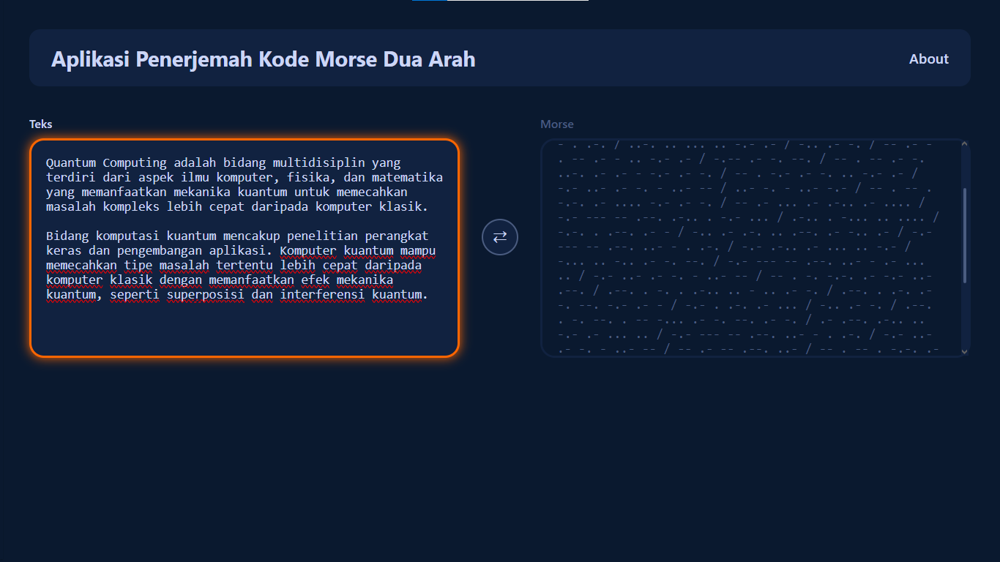

#  MorseCode Translator  MorseCode

Sebuah aplikasi web penerjemah Kode Morse dua arah (Teks ↔ Morse) yang bersih, responsif, dan real-time. Dibuat murni dengan HTML, CSS, dan Vanilla JavaScript, dengan fokus pada implementasi struktur data **Hash Table** yang efisien.

### [Lihat Live Demo]()

---

## 🚀 Fitur Utama

* **Penerjemahan Dua Arah:** Menerjemahkan Teks ke Morse dan Morse ke Teks.
* **Mode Tukar (Swap):** Tombol tukar (↔) yang intuitif untuk mengubah arah terjemahan.
* **Terjemahan Real-Time:** Hasil terjemahan muncul secara instan saat pengguna mengetik (`oninput`).
* **UI yang Jelas:** Menggunakan status `readonly` dan `placeholder` dinamis untuk memandu pengguna kotak mana yang aktif.
* **Desain Responsif:** Tampilan dioptimalkan untuk Desktop (2 kolom) dan Mobile (1 kolom).
* **Desain Modern:** Antarmuka *dark mode* yang futuristik dengan *scrollbar* kustom yang estetik.

---

## 🛠️ Tumpukan Teknologi (Tech Stack)

* **HTML5:** Kerangka semantik untuk konten.
* **CSS3:** Untuk semua *styling*, tata letak (Flexbox), responsivitas (Media Queries), dan *scrollbar* kustom.
* **Vanilla JavaScript (ES6+):** Untuk semua logika fungsional, manipulasi DOM, dan penanganan *event*.

---

## 💡 Konsep Inti & Struktur Data

Inti dari aplikasi ini adalah kecepatan. Untuk mencapai terjemahan instan, proyek ini mengandalkan **Hash Table** (diimplementasikan di JavaScript sebagai `Object` atau `Map`) untuk pencarian (lookup) data dengan kompleksitas waktu **O(1)**.

1.  **`mapTeksKeMorse`**: Sebuah *Hash Table* yang memetakan `Karakter` (Key) ke `String Kode Morse` (Value).
2.  **`mapMorseKeTeks`**: Sebuah *Hash Table* kebalikan yang memetakan `String Kode Morse` (Key) ke `Karakter` (Value).
3.  **Manajemen Status:** Sebuah variabel (`modeAwalTeksKeMorse`) melacak mode aplikasi saat ini. Tombol "Swap" membalik status ini dan memanggil fungsi `updateMode()` untuk memperbarui seluruh UI (label, `readonly`, `placeholder`, dan kelas CSS) secara bersamaan.
